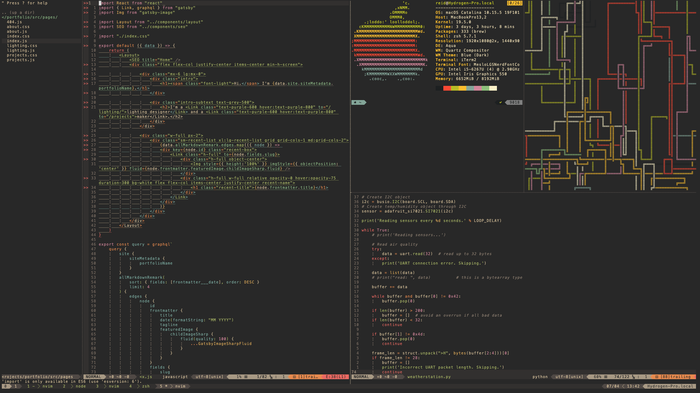

# dotfiles
Make my shell look pretty: config files!

Works on the latest MacOS Catalina.

## What's installed
 * shell: [zsh](https://www.zsh.org/) + [oh-my-zsh](https://github.com/robbyrussell/oh-my-zsh)
 * package manager: [homebrew](https://brew.sh/)
 * terminal: [iterm2](https://www.iterm2.com/)
 * multiplexer: [tmux](https://github.com/tmux/tmux) + [tmuxline.vim](https://github.com/edkolev/tmuxline.vim)
 * music: [mpd](https://github.com/MusicPlayerDaemon/MPD) + [beets](https://github.com/beetbox/beets) + [ncmpcpp](https://github.com/arybczak/ncmpcpp)
 * editor: [neovim](https://neovim.io/) + [vim-airline](https://github.com/vim-airline/vim-airline)
 * dotfile manager: [dotbot](https://github.com/anishathalye/dotbot)

## Screenshots: 
 * nvim + pipes.sh + neofetch
 
 
